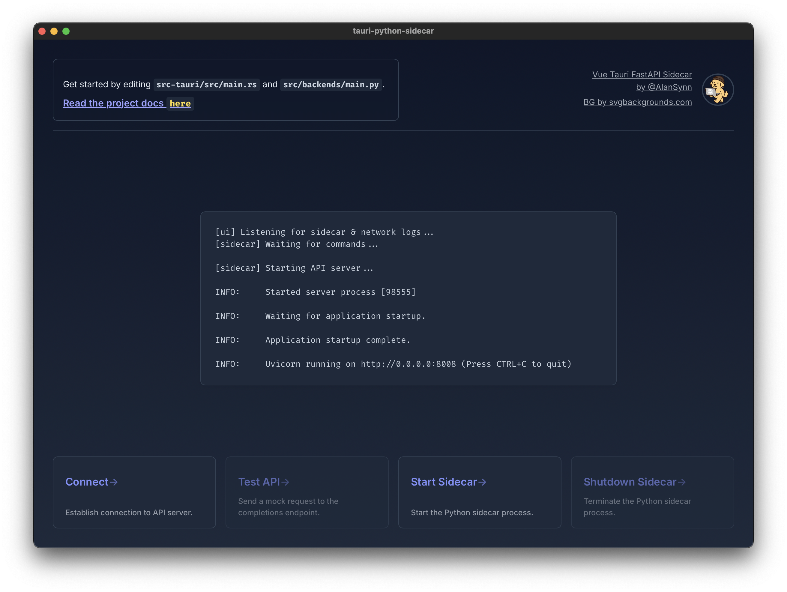

<div align="center">
  
  <h1>vue-tauri-fastapi-sidecar</h1>
  <p>Tauri with Vite-Vue using Python sidecar</p>
</div>


<div align="center">

<!-- Optional: Link to your releases if available -->
<!-- [Download the example app and try out](https://github.com/AlanSynn/vue-tauri-fastapi-sidecar/releases) -->


</div>

A native app built with Tauri v2 that spawns a Python sub-process (sidecar) which starts a FastAPI server. This project uses Vue.js (with Vite) for the frontend.


> [!NOTE]
> This project is heavily inspired by [dieharders/example-tauri-v2-python-server-sidecar](https://github.com/dieharders/example-tauri-v2-python-server-sidecar). The key differences include using Vue.js and Vite for the frontend (with a focus on strict Vite conventions), utilizing FastAPI as the backend, and adopting `uv` for managing all Python build-related tasks.


## Table of Contents

- [Table of Contents](#table-of-contents)
- [Introduction](#introduction)
- [How It Works](#how-it-works)
- [Features](#features)
- [Project Structure](#project-structure)
- [Getting Started](#getting-started)
  - [Dependencies](#dependencies)
  - [Run](#run)
- [Deploy using your machine](#deploy-using-your-machine)
  - [1. Compile Python sidecar](#1-compile-python-sidecar)
  - [2. Build Vue.js Frontend](#2-build-vuejs-frontend)
  - [3. Build Tauri App](#3-build-tauri-app)
- [Deploy using Github Actions](#deploy-using-github-actions)
- [Todo's](#todos)
- [Learn More](#learn-more)

## Introduction

This example app uses Vue.js (powered by Vite) as the frontend and Python (FastAPI) as the backend. Tauri is a Rust framework that orchestrates the frontend and backend(s) into a native app experience.

This template project is intended to demonstrate the use of single file Python executables with Tauri v2, specifically integrated with a Vite-based frontend.



Tauri "sidecars" allow developers to package dependencies to make installation easier on the user. Tauri's API allows the frontend to communicate with any runtime and give it access to the OS disk, camera, and other native hardware features. This is defined in the `tauri.conf.json` file. See [here](https://v2.tauri.app/develop/sidecar/) for more info.

## How It Works

<div align="center">
  
</div>

> [!NOTE]
> This section provides a general overview adapted from similar projects. Some details might differ slightly. Please refer to `package.json` for the exact build commands and `src-tauri/src/main.rs` for the precise sidecar management logic.

- **Frontend:** Tauri displays the frontend UI, built with Vue.js and Vite, within a native webview. This approach results in smaller application bundles compared to solutions like Electron, as it utilizes the OS's existing webview engine.

- **Backend Sidecar:** The Python backend, using the FastAPI framework (`src/backends/main.py`), is compiled into a platform-specific single-file executable using PyInstaller. This process is handled by scripts in `package.json` (e.g., `pnpm build:sidecar-winos`, `pnpm build:sidecar-macos-all`, `pnpm build:sidecar-linux`) which place the executable (e.g., `main-x86_64-pc-windows-msvc`, `main-x86_64-apple-darwin`, `main-aarch64-apple-darwin`) into the `src-tauri/bin/api/` directory.

- **Spawning & Communication:** The main Tauri Rust process (`src-tauri/src/main.rs`) is configured (in `tauri.conf.json`) to launch the appropriate Python sidecar executable when the application starts. The sidecar starts a FastAPI server (typically on `localhost:8008`). The Vue.js frontend communicates with the sidecar primarily via HTTP requests to this local server. Tauri manages the sidecar's lifecycle, ensuring it starts with the app and potentially handling shutdown signals. While the primary data communication is HTTP, Tauri might use stdin/stdout for basic lifecycle commands with the sidecar process itself.

- **Cross-Platform Builds:** The project includes separate build commands for different OS and architectures (Windows, Linux, macOS x86_64, macOS ARM64) to ensure the correct sidecar is packaged. The `pnpm build:sidecar-macos-all` command simplifies creating a universal macOS build by compiling both architectures.

- **Development:** During development (`pnpm tauri dev`), Tauri typically runs the frontend via Vite's dev server and manages the sidecar process as configured.

- **Simplified Workflow:** If you are not comfortable coding in Rust, this setup allows you to focus primarily on the frontend (Vue.js) and the backend API (Python/FastAPI) interaction via standard HTTP requests.

- **Shutdown:** When the main application window is closed, Tauri ensures that the FastAPI server and the Python sidecar process are properly shut down.

## Features

This should give you everything you need to build a local, native application that can use other programs to perform specialized work (like a server, llm engine or database).

- Launch and communicate with any binary or runtime written in any language. This example uses a Python executable.

- Communicate between frontend (javascript) and backend (Python) server via http.

- IPC communication between frontend (javascript) and Tauri (Rust) framework.

- Also control this app from an external UI source like another website, app or terminal. As long as it uses http(s) and you whitelist the url in the server config `main.py`.

## Project Structure

These are the important project folders to understand.

```bash
/app # (frontend code - Vue.js/Vite: components, main.js, App.vue, etc.)
/public # (static assets served by Vite)
/src/backends # (backend code, the "sidecar")
/src-tauri
  |  /bin/api # (compiled sidecar is put here)
  |  /icons # (app icons go here)
  |  /src/main.rs # (Tauri main app logic)
  |  tauri.conf.json # (Tauri config file for app permissions, etc.)
package.json # (build scripts)
```

## Getting Started

### Dependencies

Install all dependencies for both the frontend (JavaScript/Node) and the backend (Python):

```bash
# Recommended: Installs both Node and Python dependencies
pnpm install-reqs
```

Alternatively, you can install them separately:

```bash
# Install frontend (Node.js) dependencies only
pnpm install

# Install backend (Python) dependencies only using uv
# Assumes you have uv installed (pipx install uv)
# Reads dependencies from pyproject.toml
uv pip install .
```

Tauri requires icons in the appropriate folder. Run the script to automatically generate icons from a source image. I have included icons for convenience.

```bash
pnpm build:icons
```

### Run

Run the app in development mode:

```bash
pnpm tauri dev
```

## Deploy using your machine

### 1. Compile Python sidecar

Run this at least once before running `pnpm tauri dev` or `pnpm tauri build` and each time you make changes to your python code:

```bash
pnpm build:sidecar-winos
# OR
pnpm build:sidecar-macos-all # Creates a universal binary for both x86_64 and aarch64 macOS
# OR
pnpm build:sidecar-linux
```

In case you dont have PyInstaller installed run:

```
pip install -U pyinstaller
```

A note on compiling Python exe (the -F flag bundles everything into one .exe). You won't need to run this manually each build, I have included it in the build scripts.

### 2. Build Vue.js Frontend

Build the static frontend assets using Vite. This step is usually handled automatically by the `pnpm tauri build` command via the `beforeBuildCommand` in `tauri.conf.json`, but can be run manually:

```bash
pnpm build
```

### 3. Build Tauri App

Tauri runs the frontend build command (`pnpm build` by default in `tauri.conf.json`) before bundling the application.
Build the production app on your machine for a specific OS:

```bash
pnpm tauri build
```

This creates an installer located here:

- `<project-dir>\src-tauri\target\release\bundle\nsis`

And the raw executable here:

- `<project-dir>\src-tauri\target\release`

## Deploy using Github Actions

Fork this repo in order to access a manual trigger to build for each platform (Windows, MacOS, Linux) and upload a release.

You can then modify the `release.yml` file to suit your specific app's build pipeline needs. Workflow permissions must be set to "Read and write". Any git tags created before a workflow existed will not be usable for that workflow. You must specify a tag to run from (not a branch name).

Initiate the Workflow Manually:

1. Navigate to the "Actions" tab in your GitHub repository.
2. Select the "Manual Tauri Release" workflow.
3. Click on "Run workflow" and provide the necessary inputs:

   - release_name: The title of the release.
   - release_notes (optional): Notes or changelog for the release.
   - release_type: ("draft", "public", "private")

## Todo's

- Example api endpoint that demonstrates handling file paths for `--add-data` files and using `sys._MEIPASS` to find the path relative to the production executable.

- Pass parameters to the sidecar (like server port) via a frontend form.

- Pass argument `--dev-sidecar` to `pnpm tauri dev` script that tells Tauri to run sidecars in "dev mode". This would allow for running the python code from the python interpreter installed on your machine rather than having to manually compile with `pnpm build:sidecar-[os]` each time you make changes to the Python code.

- Develop a standalone multi-sidecar manager that can handle startup/shutdown and communication between all other sidecars spawned in the app.

## Learn More

- [Tauri Framework](https://tauri.app/) - learn about native app development in javascript and rust.
- [Vue.js](https://vuejs.org/guide/introduction.html) - learn about the progressive JavaScript framework.
- [Vite](https://vitejs.dev/guide/) - learn about the frontend tooling.
- [FastAPI](https://fastapi.tiangolo.com/) - learn about FastAPI server features and API.
- [PyInstaller](https://pyinstaller.org/en/stable/) - learn about packaging python code.
